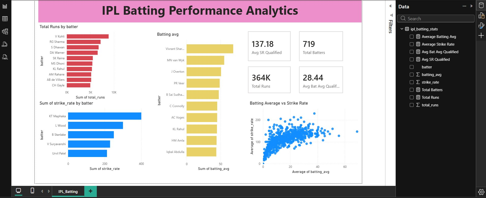

# IPL Batting Performance Analytics

A batting analytics project covering IPL ball-by-ball data (2008–2026), built with Pandas, SQL, and Power BI. Aggregates raw delivery-level data into per-batter career stats (runs, average, strike rate, innings) and visualizes them in an interactive dashboard.



## Repo structure

```
ipl-batting-analytics/
├── data/
│   └── ipl_batting_stats_v2.csv     # Aggregated per-batter stats (719 batters)
├── scripts/
│   ├── ipl_analysis_fixed.py        # Generates ipl_batting_stats_v2.csv from raw data
│   └── ipl_analysis_fixed.sql       # Leaderboard / summary queries on the aggregated table
├── dashboard/
│   ├── IPL_.pbix                    # Power BI report
│   └── ipl_batting_dashboard.png    # Static chart export from the Python script
└── assets/
    └── dashboard_preview.png        # Screenshot used in this README
```

Note: the raw ball-by-ball source file (`IPL.csv`, ~105MB) is **not included** in this repo — it exceeds GitHub's 100MB file size limit. See [Data](#data) below.

## Data

Two data sources feed this project:

- **Raw ball-by-ball data** (`IPL.csv`, not committed here): one row per delivery, every IPL match from 2008 to 2026. Used as the source of truth; `scripts/ipl_analysis_fixed.py` aggregates it into the per-batter stats table.
- **Aggregated batting stats** (`data/ipl_batting_stats_v2.csv`): one row per batter, with `total_runs`, `batting_avg`, `strike_rate`, `innings`, `dismissals`, `balls_faced`, and `most_active_year`. This is what the Power BI dashboard and SQL queries actually read from.

If you want to regenerate the aggregated file yourself, place `IPL.csv` in the same folder as the script and run:

```bash
pip install -r requirements.txt
python scripts/ipl_analysis.py
```

## Dashboard

Open `dashboard/IPL_.pbix` in Power BI Desktop. It shows total runs by batter, batting average and strike rate leaderboards, qualified-average/strike-rate KPI cards, and a scatter plot of average vs. strike rate.

## Known limitations

A few things worth knowing if you build on this:

- The two leaderboard charts ("Batting avg" and "Sum of strike_rate by batter") rank by raw values with a Top N filter, with no minimum-sample qualifier built into the visual. For small-sample players this can surface flukes (e.g. a bowler who faced 3 balls). The dashboard's KPI cards already apply a qualification threshold; if you want the same logic on the charts, add a filter for `dismissals >= 20` (average) or `balls_faced >= 200` (strike rate) — both columns are in `ipl_batting_stats_v2.csv`.
- Strike rate is calculated as `total_runs / balls_faced * 100`, where `balls_faced` excludes wides only (standard cricket convention — no-balls still count as a ball faced). An earlier version of this dataset used the wrong denominator and over-counted strike rate by roughly 0.5% on average; this has been corrected in `ipl_analysis_fixed.py` and `data/ipl_batting_stats_v2.csv`.

## Requirements

```
pandas
matplotlib
seaborn
```

## License

MIT — see [LICENSE](LICENSE).
